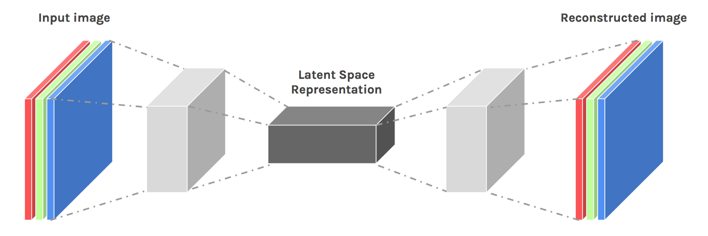
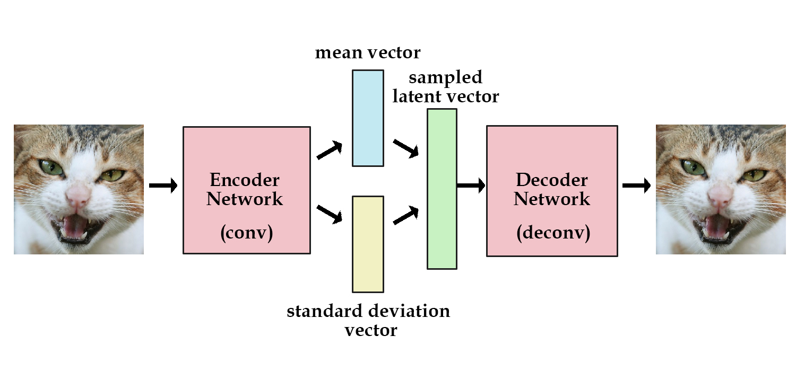

# Pytorch-Autoencoders-fashionMnist
Implementation of 3 flavours of autoencoders (vanilla AE, Convolutional-AE, Variational-AE) trained on [fashionMnist dataset, courtsey of zalandoresearch](https://github.com/zalandoresearch/fashion-mnist).
 **A notebook is also provided which enables a simple and easy-to-use playfield to try out these different models.**

## Vanilla-Autoencoder Architecture

    
  
Simplified vanilla autoencoder architecture.

## Convolutional-Autoencoder Architecture

    
  
Simplified convolutional-autoencoder  architecture.

## Variational-Autoencoder Architecture

    
  
Simplified variational-autoencoder architecture.

## Training using a ubiquitous `Learner`
A common learner was devised to train all three models. This common `Learner` class enables training, testing, and progress visualization routine in a coherent manner.
